# DevOps Pipeline Project Report

## 📌 Project Overview

This project showcases a complete CI/CD DevOps pipeline for deploying a Node.js application using modern DevOps tools including Git, GitHub, Docker, Terraform, Ansible, Jenkins, and Shell scripting.

---

## ✅ Steps Completed

### Step 1: GitHub Repository Setup with Branching Strategy

* Created a GitHub repo with the following branches:

  * `main` (protected)
  * `develop`

### Step 2: Node.js App Creation

* Simple Express app in `src/index.js`
* Output: “Hello from DevOps Pipeline Node.js App!"
* Tested locally using: `node src/index.js`

### Step 3: Dockerization & DockerHub

* Dockerfile in root directory
* Built and pushed the image to DockerHub:

  * `miteshsaste/devops-nodejs-app:latest`

* Tested locally using: `docker run -d -p 3000:3000 devops-nodejs-app`

### Step 4: Terraform Infrastructure Provisioning

* Wrote Terraform scripts to provision:

  * AWS EC2 instance
  * Security Group
  * SSH Key Pair
  * VPC
  * Subnet
  * Elastic IP

* Variables defined in `variables.tf`

### Step 5: Ansible Deployment

* Used dynamic `hosts.ini` with Terraform output.
* Created an Ansible playbook:

  * Installs Docker (based on OS family)
  * Pulls app image
  * Runs app container on port 80

### Step 6: Jenkins CI/CD Pipeline

* Jenkins installed with Docker, Terraform, Ansible, Git plugins, AWSCLI
* Configured Jenkins pipeline with `Jenkinsfile` stages:

  * Clone repo
  * Build Docker image
  * Push to DockerHub
  * Trigger Terraform apply
  * Deploy using Ansible
  * Clean up with shell script

### Step 7: Cleanup Script

* Uses `set -euo pipefail` for strict error handling.
* Removes:

  * Stopped containers
  * Dangling and unused Docker images
  * Unused networks

* Displays lists of:

  * Exited containers
  * Dangling images

---

## 📂 Branch Merging Strategy

* All changes were made in the `develop` branch.
* A Pull Request will be created to merge `develop` into protected `main`.
* PR will include all 7 steps and pass Jenkins checks before merge.

---

## 📸 Screenshots & Logs

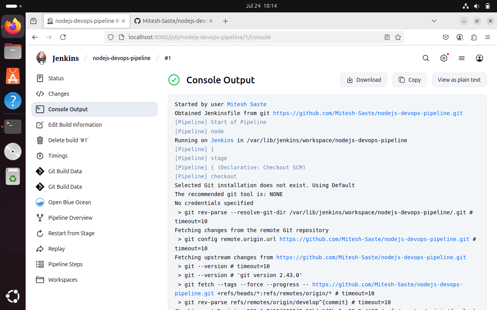

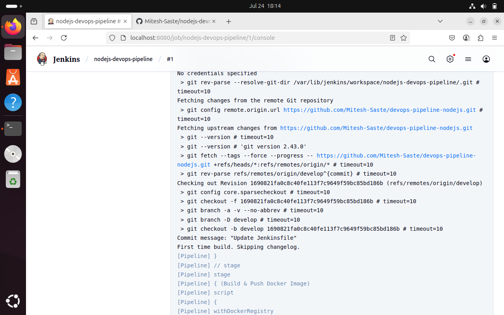

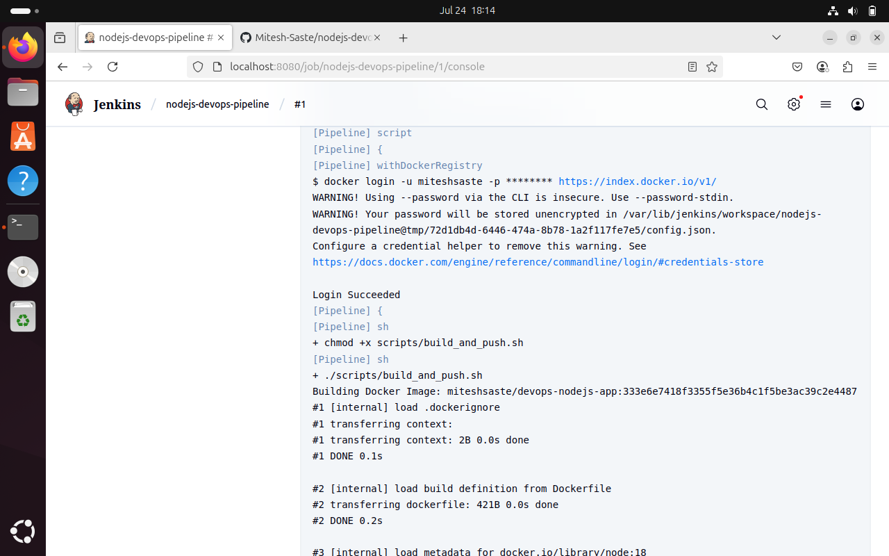

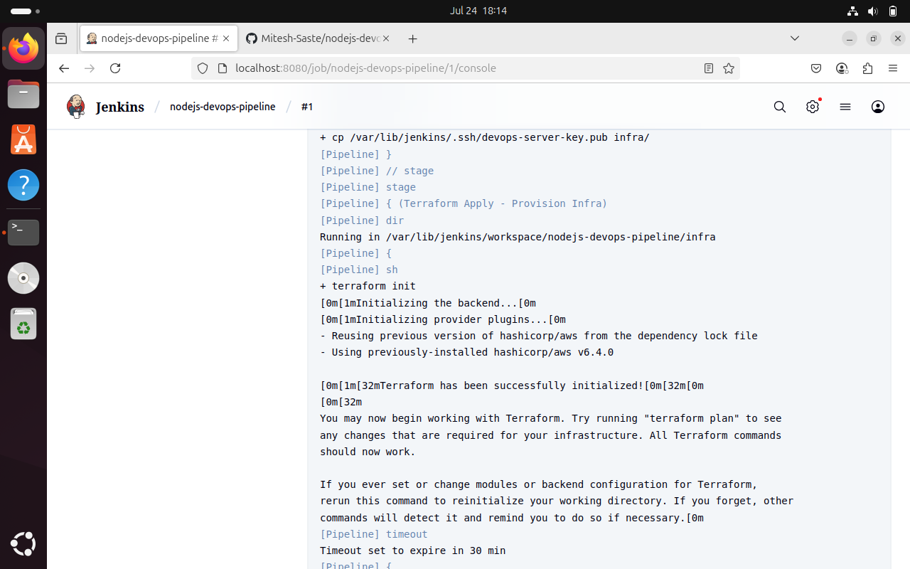

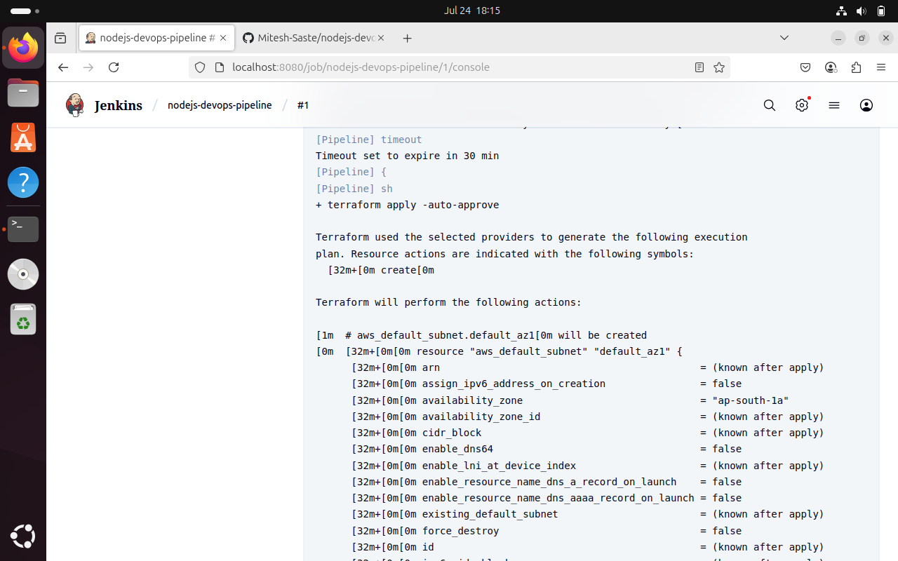

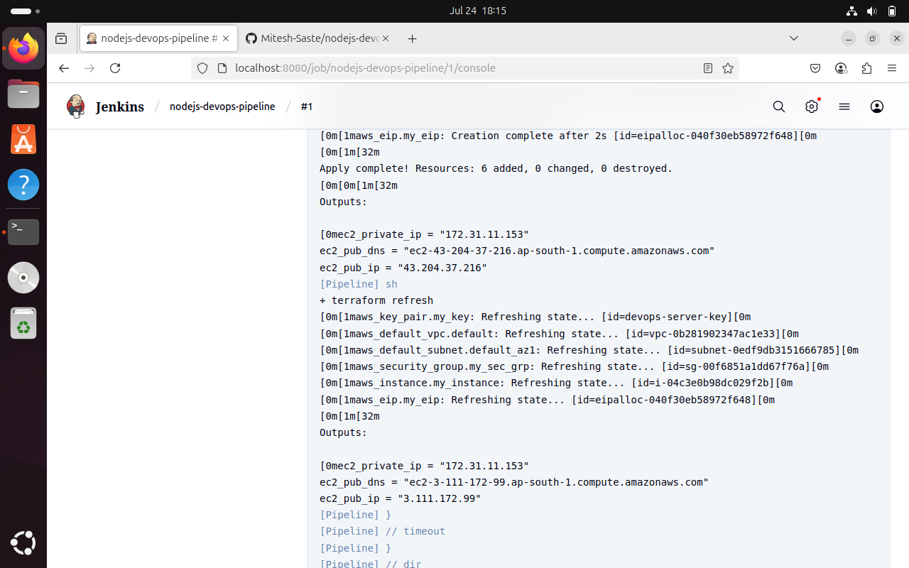

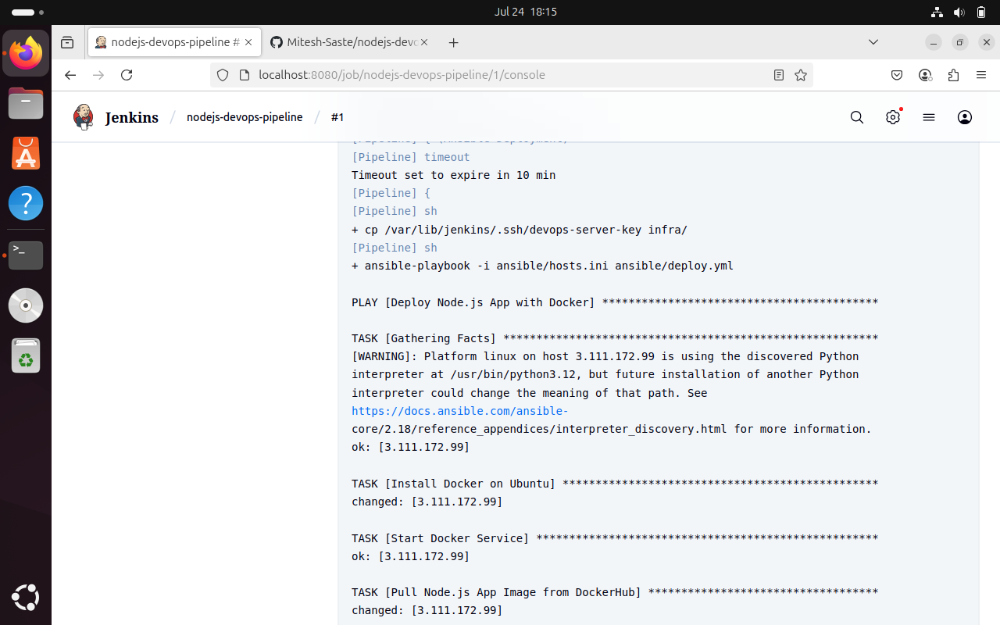

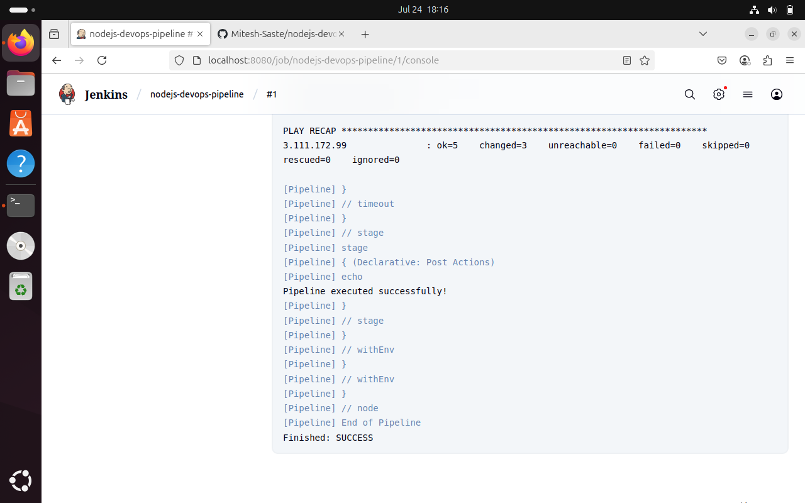

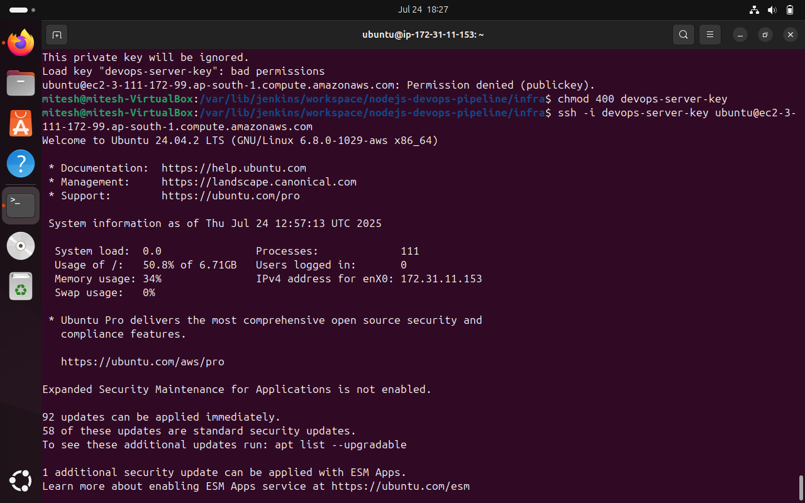

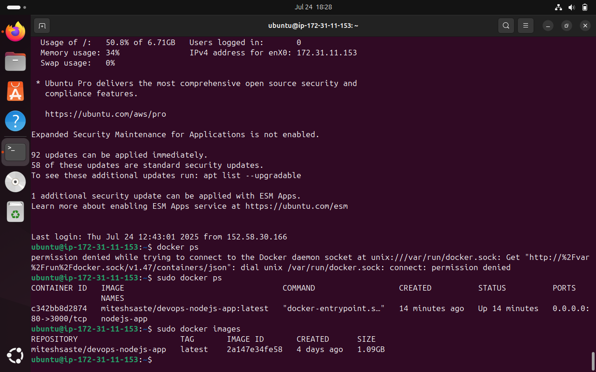

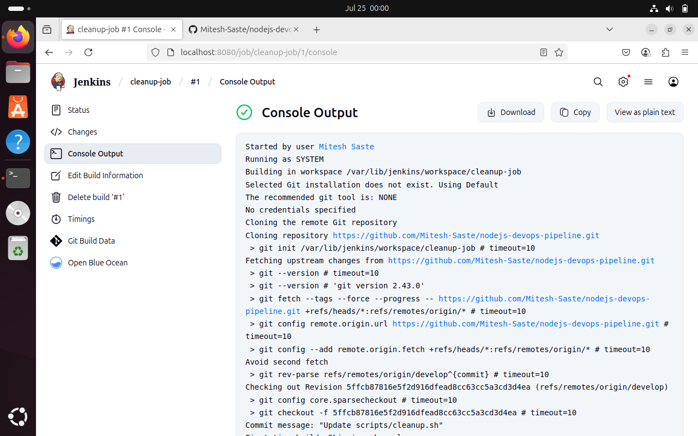

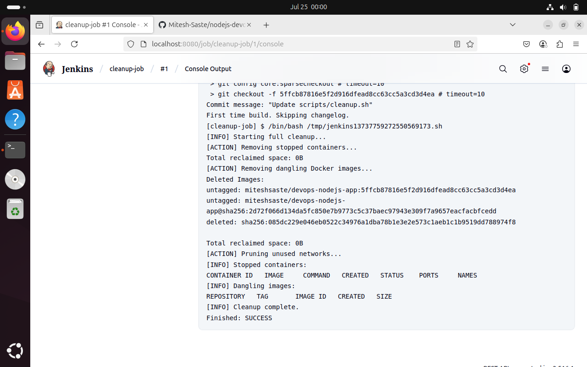

---

## 🙌 Final Notes

This project demonstrates a complete end-to-end DevOps pipeline from coding to deployment. It is modular, automated, and production-ready for scalable teams

---

### 🔗 DockerHub Repo

[https://hub.docker.com/repository/docker/miteshsaste/devops-nodejs-app](https://hub.docker.com/repository/docker/miteshsaste/devops-nodejs-app)

### 🔗 GitHub Repository

[https://github.com/Mitesh-Saste/nodejs-devops-pipeline](https://github.com/Mitesh-Saste/nodejs-devops-pipeline)

---

✅ **All 7 steps are complete.**
